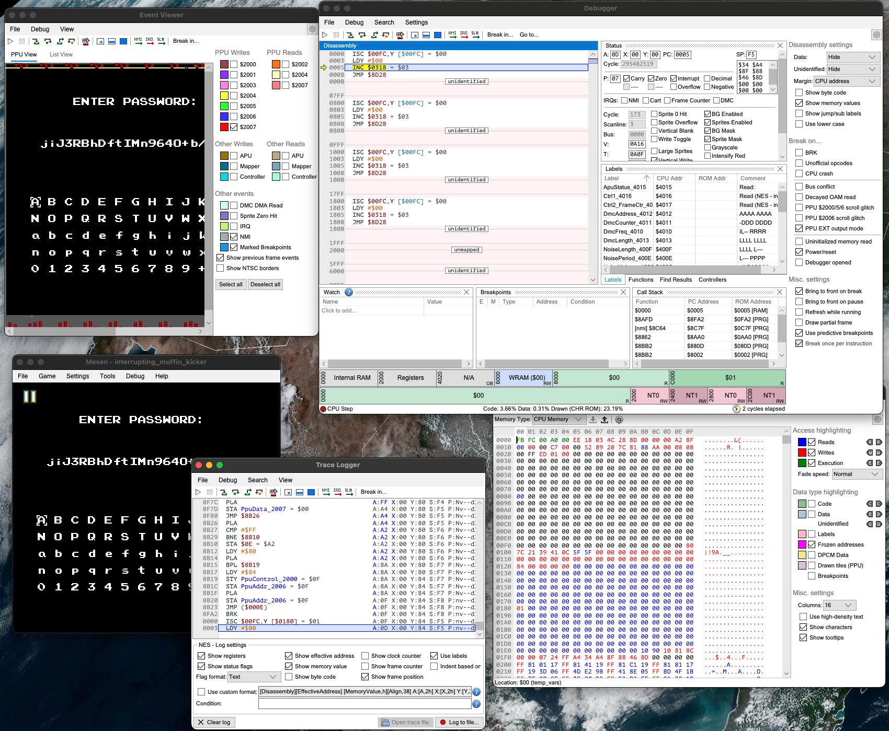

# Muffin Kicker

A simple NES "game". No actual gameplay exist, but the main menu has a password screen that allows you to load a saved game. By reverse-engineering the password format, you can generate a password that has the level field set to 4.

The password is base64-encoded and decodes to a 16-byte string with the following format:

- Byte 0 is a "rotation" counter used to obfuscate the password. The remaining 15 bytes of the password are bitwise-rotated to the left this many times. After each rotation step, the remaining 15 bytes of the password are XORed against the string `11 22 33 44 55 66 77 88 99 AA BB CC DD EE FF`.
- Byte 1-2 is a 16-bit checksum. The checksum is computed by adding together bytes 3-15 plus the constant 13, and rotating the result to the left by the number of times stored in byte 3.
- Byte 4 is the level index. If this is 4, the flag will be printed.
- The remaining bytes are not used for aything interesting; they exist so that you can build larger payloads for Interrupting Muffin Kicker.

An example password that prints the flag is `ZiRGSAqszvETNVd5m73fw`.

# Interrupting Muffin Kicker

The challenge binary is exactly the same, execpt for a bounds-check that disallows passwords with the level index set to 4. This requires you to find a bug in the game that can be exploited through the password field.

The particular bug is within the game's VRAM buffering code. The NES has two seperate memory busses: one for general-purpose code and data, and another for video memory. The CPU can only access video memory when rendering is disabled or during the vertical blanking interval between frames, as the bus is constantly in use while the PPU (Picture Processing Unit) is rendering the scene. So, whenever the game logic needs to write to VRAM, it writes the data into a buffer in CPU memory; and the vertical blanking interrupt handler transfers this buffer over to VRAM. This is a standard design pattern used by essentially all NES games.

However, the problem is that there is no locking around the VRAM buffer; it's possible for an interrupt handler to flush the buffer while the buffer is being written to. The amount of time it takes to decode the password is variable due to the bit-rotation loops, so by changing the number of bit rotations required to decode your password, you can manipulate the timing such that an interrupt occurs at the right time.

The VRAM buffer is structured as a sequence of entries with the following format:

- Byte 0: An offset (relative to ROM address $8F00) to jump to in order to transfer these bytes to VRAM. Page $8F begins with an unrolled loop that copies 32 bytes, and the VRAM buffering routines calculate an index to jump to within the middle of this loop to copy the correct number of bytes. A value of $FF signifies the end of the buffer.
- Byte 1: The high byte of the VRAM destination address (and a bit indicating whether the PPU's increment-by-32 flag should be set for this transfer).
- Byte 2: The low byte of the VRAM desination address.
- Remaining bytes: The data to transfer.

The buffer begins at RAM address $0100 and grows upwards, towards the stack which begins at address $01FF and grows downwards. This allows the buffer to be accessed using stack-access instructions for performance.

When the game writes an entry to the buffer, it first writes the header; then the data; then the $FF-terminator. This means there is a brief period where the buffer is unterminated. If an interrupt attempts to flush the buffer during this time, it will read past the end of the buffer and start reading garbage data from the stack. If this happens, the game is likely to read an invalid offset and jump to some weird spot within page $8F. My exploit happened to read an $A2 byte from the stack, causing execution to jump to address $8FA2, which is unused and filled with zero bytes. On the 6502, opcode 00 corresponds to the BRK instruction, which raises a software interrupt. As this type of interrupt is not used by the game, the interrupt vector is left as 0's, so execution jumps to address $00 -- the RAM address where the decoded password bytes are stored.

Some of this memory has been re-used for other purposes, but most of the password is still intact, and the bytes that were overwritten do not cause a crash. I set bytes 05-0A of my password to `EE 18 03 4C 28 8D`, corresponding to the following instructions:

```
INC $0318
JMP $8D28
```

The first instruction increments the current level. Since we are not allowed to set the current level to 4, I use the password to set it to 3 and then execute this increment instruction.

The second instruction jumps back just before the main game loop, in order to recover from the crash and resume the game. We can't use a simple return instruction since the stack pointer is currently being used to index the VRAM buffer; and some of the most obvious ways to return control to the game will fail because the VRAM buffer is still unterminated, causing the game to crash again on the next frame. But there are a few addresses that will clear the VRAM buffer and return control to the main game loop; this is one of them.

The password I used is `jiJ3RBhDftIMn964O+b/RA`.

--

A significant part of both of these challenges is figuring out what tooling to use, especially since we're working with a 40-year-old architecture. Modern reverse-engineering tools like Ghidra or IDA will not be much use -- they will probably *work*, but they won't give you a whole lot of insight beyond just manually reading a disassembly. Rather, you'll want to use debugging tools from the NES homebrew/ROMhacking scene. There is an entire world of talented reverse-engineers and sophisticated tooling that doesn't see much use in CTFs, and part of my intentions behind this challenge was to show off some of the neat tooling and workflows that exist for reverse-engineering retro games.

For writing this challenge, I primarily used [Mesen2](https://github.com/SourMesen/Mesen2), an incredibly powerful debugging emulator that supports a variety of retro game consoles. It has a very high-quality debugger and disassebler with powerful dynamic tracing and instrumentation features:



Another excellent debugging emulator is FCEUX, specifically [the Qt port by the TASVideos community](https://github.com/TASEmulators/fceux).

You'll also need good documentation on the NES hardware. [Nesdev.com](https://nesdev.com/wiki) is a wealth of information, and the [Obelisk 6502 reference](http://6502.org/users/obelisk/6502/) is a good source for learning about the 6502 CPU architecture and instruction set.
